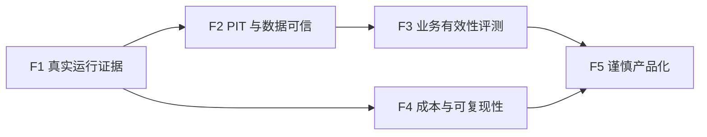

# TradingAgents-CN Future：后续维护与演进路线图

> 状态日期：2026-08-25  
> 当前版本口径：`v0.2.3` 源码版本，项目能力处于 `interview-ready`，不等于 `production-ready`  
> 适用对象：未来的维护者、开发 Agent，以及几个月后重新打开仓库的自己  
> 基线证据：[封箱总结](docx/开发文件/封箱总结-项目完成情况与面试验收.md)、[架构说明](docs/architecture.md)、[PIT 审计](docs/point-in-time-audit.md)、[Screener 专项报告](docx/开发文件/Screener专项建议修改报告.md)
> 配套执行手册：[Future Doing：可拆分实施计划](<Future Doing.md>)

## 1. 先说结论

这个项目已经完成“工程化研究原型”的主体建设：主 LangGraph 分析链和 Screener 候选发现链都能运行，具备状态契约、预算保护、证据门禁、供应商降级、健康监控、回测框架和 682 项离线测试。它已经适合作为面试项目展示，也适合继续做研究型开发。

它目前最缺的不是更多 Agent、更多策略或更漂亮的界面，而是以下四类证据：

1. **连续运行证据**：真实 Screener 只有 2 个不同交易日，尚未达到既定 5 日门槛；
2. **历史真实性证据**：部分基本面和财务数据仍是实时快照，不满足严格 Point-in-Time；
3. **决策有效性证据**：评测、消融和回测框架存在，但还没有足够样本支持准确率、超额收益或多智能体增益结论；
4. **生产运行证据**：缺少长期调度、故障恢复、真实 HITL 全流程、稳定成本和服务级目标。

因此，下次恢复开发时，应先完成“证据闭环”，再考虑扩大产品边界。

### 1.1 两份 Future 文件如何配合

| 文件 | 负责回答 | 更新时机 |
|---|---|---|
| `Future.md` | 为什么做、先做什么、哪些边界不能突破 | 项目方向、优先级或风险判断变化时 |
| `Future Doing.md` | 修改哪些文件、执行哪些步骤、怎样测试和提交 | 工作包开工、完成、阻塞或拆分时 |
| `docx/开发文件/封箱总结-项目完成情况与面试验收.md` | 截至封箱日真实完成了什么 | 新阶段形成新证据时追加，不重写历史 |
| `docs/point-in-time-audit.md` | 哪些数据可以安全用于历史日期 | 数据契约或供应商语义变化时 |

未来 Agent 应先在本文件选择方向，再到 `Future Doing.md` 领取一个工作包。禁止同时领取多个相互依赖的工作包，也不要把长期愿景直接当成当前迭代需求。

### 1.2 当前成熟度快照

| 能力域 | 当前证据等级 | 当前判断 | 升到下一等级需要什么 |
|---|---|---|---|
| Analyzer 执行链 | `LIVE_SMOKE_VERIFIED` | Agnes headless 已跑通 | 真实 HITL、故障恢复、多次运行分布 |
| Screener 执行链 | `LIVE_SMOKE_VERIFIED` | FOCUSED/MVP/FULL 已跑通 | 至少 5 个不同交易日验收 |
| DeepAnalyzer | `LIVE_SMOKE_VERIFIED` | 合法候选夹具跑通 | 自然候选与多日真实样本 |
| 数据供应商降级 | `LIVE_SMOKE_VERIFIED` | 健康、熔断、降级可见 | 多日失败率、主备源 SLA 和契约 |
| Point-in-Time | `OFFLINE_VERIFIED`（部分） | 行情/新闻部分安全，财务未闭合 | 公告时间、历史快照和 provenance |
| 回测 | `OFFLINE_VERIFIED` | 时序与数学护栏存在 | 历史成分股、多窗口、成本和留出集 |
| 正确性评测 | `CODE_READY` | 框架存在，无统计结论 | 冻结案例集和真实小样本实验 |
| 消融与校准 | `CODE_READY` | runner 存在，无正式报告 | 小矩阵、重复实验和质量/成本对比 |
| 可复现安装 | `OFFLINE_VERIFIED`（局部） | 主 CI 可安装，完整数据栈不完整 | extras、锁文件一致性和 Windows smoke |
| 生产运行 | 未达到 | 无 SLO、长期调度与运营证据 | 20 日稳定性、告警、恢复、安全和合规 |

## 2. 当前已经具备的能力

### 2.1 Analyzer 主链

- LangGraph 编排分析师、研究辩论、交易决策、风险辩论和组合经理；
- 支持 checkpoint、run-id、恢复参数、预算保护和结构化运行产物；
- 支持 HumanGate 的离线暂停、恢复与终止契约；
- 对工具失败、未注册工具、证据缺失和数字验证失败进行显式降级；
- 已使用 Agnes `agnes-2.5-flash` 完成一次 headless 真实运行；
- 已对 DeepAnalyzer 使用可审计候选夹具完成真实 Agnes 执行契约验收。

### 2.2 Screener 链

- 支持 FOCUSED、MVP、FULL 和 CUSTOM 股票池；
- 具备 Stage A/Stage B 输入预算与阶段超时；
- 具备 Technical、SmartMoney、Policy 三策略与 Merger；
- 区分评分、置信度、证据覆盖和正式推荐资格；
- 数据不足时允许保留 research candidate，但必须令 `recommendation_eligible=false`；
- 已真实完成 FOCUSED → MVP → FULL 阶梯运行；
- 已提供连续交易日 acceptance monitor，且不会用重复日期伪造通过。

### 2.3 数据与工程能力

- 主链与 Screener 共享供应商健康状态，记录失败率、平均延迟、P95 和错误类别；
- 具备超时、重试、熔断、空缓存拒绝、字段归一化和 UTF-8 产物保护；
- 已接入 CNINFO 官方公告，Tushare 财务适配器存在但默认关闭；
- AkShare、yfinance、BaoStock 等免费源承担多级后备；
- 现有 CI 在 Python 3.10 / Ubuntu 上运行离线测试并构建 wheel；
- 全量离线回归基线为 `682 passed`。

## 3. 现有问题与具体改进方式

以下优先级按“如果不解决，会不会阻碍可信结论或长期维护”排序，而不是按功能是否吸引人排序。

### P0-1：决策有效性仍未被统计证明

**现状**

- 单次 Agnes 运行只能证明执行链可用，不能证明结论正确；
- DeepAnalyzer 真实验收使用的是契约夹具，不是当天自然产生的正式候选；
- `eval`、`ablation`、回测和敏感性框架已经存在，但缺少足够真实实验产物；
- 当前 eval / ablation CLI 和 runner 仍存在 DeepSeek 硬编码默认值；eval CLI 在真实调用后也没有把报告的 `real_model_run` 显式置为 `true`，正式实验前必须先修复证据语义；
- 现有回测不能直接被宣传为未来收益能力。

**改进方式**

1. 建立 20～50 个固定历史案例，覆盖上涨、下跌、震荡、财报异常、重大公告和数据缺失；
2. 先消除 runner 的 provider 硬编码，并确保真实运行报告正确标记 `real_model_run=true`；
3. 每个案例冻结 `as_of` 日期、可见数据、预期标签和未来观察窗口；
4. 先跑 5 个案例的低成本试验，确认没有时间穿越后再扩样本；
5. 输出方向准确率、混淆矩阵、覆盖率、拒绝率、校准误差，而不只统计收益；
6. 对“单 Agent / 多 Agent”“辩论开 / 关”“DeepAnalyzer 开 / 关”做小规模消融；
7. 所有结论同时报告样本量、时间窗口、交易成本和失败案例。

**完成标准**

- 有版本化评测集及数据说明；
- 至少 20 个无前视偏差案例完成评测；
- 有基线、完整系统和至少一个消融配置的对比报告；
- README 中出现的每个业务数字都能追溯到机器生成 artifact。

### P0-2：Point-in-Time 数据链尚未闭合

**现状**

- 技术行情与部分新闻具有截止日过滤；
- 基本面快照、AkShare 财务三表、内幕交易和部分事件工具仍是 `REALTIME_ONLY` 或 `CONDITIONAL`；
- “报告期不晚于交易日”不等于“公告在交易日之前已经公开”；
- 这会污染历史评测和回测，是当前最大的业务可信度风险。

**改进方式**

1. 为每个工具定义统一的 `as_of`、`published_at`、`period_end` 和 `retrieved_at` 字段；
2. 财务数据必须按公告时间过滤，不能只按报告期过滤；
3. 优先接入有历史公告时间的正式接口，或建立每日不可变快照；
4. 原始响应按内容哈希保存，派生指标保留公式、原始字段、单位与期间；
5. 历史评测遇到 `REALTIME_ONLY` 工具时应拒绝执行，不能静默使用当前快照；
6. 为每个 provider 增加离线 contract fixture 和少量人工核验样本。

**完成标准**

- 历史评测使用到的工具全部达到 `SAFE`，或被明确排除；
- 财务证据满足 `published_at <= as_of`；
- 任意报告数字可追溯到原始供应商记录和派生公式；
- PIT 审计文档由静态审计升级为“契约测试 + 人工抽样验证”。

### P0-3：连续真实运行和 HITL 证据不足

**现状**

- Screener acceptance 目前只有 2 个不同交易日，既定门槛为 5 日；
- 最新代码没有留下完整真实 HumanGate `pause → comment → resume → abort` 证据；
- 一次成功运行不能证明跨日稳定性、恢复能力或成本稳定性。

**改进方式**

1. 连续至少 5 个不同交易日运行 FOCUSED；资源允许时扩展为 20 个交易日；
2. 每日保存运行配置、commit、数据源健康、候选资格、耗时、Token 和失败原因；
3. 真实执行一次 HumanGate 暂停、评论恢复和终止，并保存 checkpoint 与审计产物；
4. 增加一次故障注入：运行中断后从 checkpoint 恢复；
5. 验收失败时记录原因，不修改日期、阈值或 artifact 来“制造通过”。

**完成标准**

- acceptance monitor 对至少 5 个真实交易日返回 0；
- HumanGate 四个动作有真实运行日志与产物；
- 中断恢复前后 run-id、状态和最终报告关系可解释；
- 形成真实运行耗时与 Token 分布，而非单次数字。

### P0-4：数据供应商仍然是长期单点风险

**现状**

- 免费接口会漂移、限流、返回空页或结构变化；
- CNINFO 官方公告可用，但财务主数据仍依赖不稳定后备链；
- Tushare 适配器已接入但因权限不足默认关闭；
- 当前健康监控能暴露失败，却不能让不稳定供应商变得稳定。

**改进方式**

1. 把“公告、行情、财务、资金流、新闻、概念”分别定义供应商优先级，不设置一个全能主源；
2. 正式公告优先交易所 / CNINFO，历史行情优先稳定行情源，财务优先具备公告时间和版本语义的独立 API；
3. 建立 provider capability manifest：支持字段、市场、历史范围、频率限制和 PIT 等级；
4. 供应商切换必须通过契约测试，不能只靠 `hasattr` 判断接口存在；
5. 对 schema drift、空数据、认证失败、限流和超时分别设告警与熔断；
6. 若未来购买付费源，先用 shadow mode 与现有源并行比对，不立即替换正式链。

**完成标准**

- 关键数据域至少有一个可信主源和一个可用备源；
- 每个 provider 有能力清单、契约 fixture 和健康阈值；
- 连续运行报告能回答“本次每项关键结论用了哪个源”；
- 数据源全部不可用时输出 `INSUFFICIENT_EVIDENCE`，不生成高确定性推荐。

### P1-1：回测仍需要更严谨的市场模拟

**现状**

- 已修复 T/T+1 时序和部分前视偏差，并具备样本外窗口；
- 仍需要更系统地处理交易成本、滑点、停牌、涨跌停不可成交、成分股历史变更和退市偏差；
- 单一窗口或当前成分股回放容易产生幸存者偏差。

**改进方式**

- 使用多个市场阶段做滚动或 walk-forward 验证；
- 增加佣金、印花税、滑点、成交量约束和不可成交规则；
- 保存历史指数成分，避免用今天的股票池回测过去；
- 将参数选择窗口与最终测试窗口严格分离；
- 报告基准收益、超额收益、最大回撤、换手率、拒单率和容量估计。

**完成标准**

- 至少 3 个市场阶段与 1 个完全留出的测试窗口；
- 0 / 10 / 20 bps 成本敏感性报告；
- 报告明确是否使用历史成分股；
- 参数调优不读取最终测试窗口。

### P1-2：阈值和推荐标签仍需要校准

**现状**

- 评分、置信度和资格已经分离，这是正确的结构；
- Merger 权重、策略阈值和风险折扣仍主要来自规则设计与局部样本；
- “推荐被阻断”可能是严格门禁正常工作，也可能是阈值过严，当前样本不足以区分。

**改进方式**

- 对关键阈值做 ±10%～20% 敏感性分析；
- 用训练 / 验证 / 测试时间切片校准，不在测试集上调参；
- 画置信度可靠性曲线，检查 70% 置信度是否接近 70% 命中率；
- 单独统计 `NO_CANDIDATE_VALID`、`research_candidate` 和正式推荐的后续表现；
- 记录每次阈值变更的理由、数据版本和预期影响。

**完成标准**

- 没有无法解释的“魔法数字”；
- 每个高影响阈值都有敏感性或校准证据；
- 正式推荐覆盖率和拒绝率有稳定区间；
- 阈值修改有 ADR 或实验报告。

### P1-3：LLM 成本、时延与输出稳定性仍可改进

**现状**

- 已阻断无限工具循环和明显 Token 失控；
- 一次真实主链仍约 9 分钟，历史运行输入上下文曾达到约 310K Token；
- 单次运行数字不足以描述 P50 / P95 成本和不同标的复杂度；
- 结构化字段仍可能依赖后置解析和降级逻辑。

**改进方式**

- 为每个节点记录输入 Token、输出 Token、耗时、工具次数、输出哈希和缓存命中；
- 将完整历史消息替换为阶段摘要与结构化 evidence references；
- 按任务复杂度启用轻量 / 标准 / 深度预算；
- 对重复结论和低新增信息节点提前终止；
- 优先使用 schema-constrained 输出，解析失败只允许一次受控修复；
- 建立真实运行 P50 / P95 Token、时延和费用预算。

**完成标准**

- 20 次真实小样本有节点级成本分布；
- 在质量不显著下降的条件下，标准运行 Token 或时延至少下降 30%；
- 无节点可以无限重试或无限调用工具；
- 所有正式决策字段均可结构化校验。

### P1-4：可复现性、CI 和配置仍有缺口

**现状**

- 仓库已有 `uv.lock`，但 CI 使用 `pip install -e .`，没有以锁文件作为唯一安装基线；
- `pyproject.toml` / `uv.lock` 当前只声明 yfinance，AkShare、BaoStock、Tushare 等适配器依赖未进入标准安装或可选 extra；完整 Screener 能力依赖本机已有环境；
- CI 只覆盖 Ubuntu + Python 3.10，而真实开发环境是 Windows；
- `.env.example` 已列出 Agnes 与 Tushare 的注释字段，但没有给出 `LLM_PROVIDER=agnes`、quick/deep 模型和完整数据 extras 的成套示例；默认未注释项仍以 OpenAI 为入口；
- 源码版本为 `0.2.3`，而“面试封箱标签”曾建议使用 `v0.9.0-interview-ready`，发布语义需要统一。

**改进方式**

1. 决定并记录唯一依赖流程：优先采用 `uv sync --locked`，CI 也使用同一路径；
2. 把非核心供应商依赖整理为明确 extras，例如 `data-cn`、`tushare`，并让能力探测提示对应安装命令；
3. CI 增加 Python 3.10 / 3.11，至少保留一个 Windows smoke job；
4. 增加离线、联网 smoke、夜间真实探测三层测试，联网层不得阻塞普通 PR；
5. 更新 `.env.example`，增加 Agnes provider/model 的成套注释示例，只保留占位符和开关，不提交任何密钥；
6. 统一包版本、Git tag 和发布说明，避免 `0.2.3` 与 `v0.9.0` 含义冲突；
7. 提供一个不消耗真实 Token 的最小演示，以及一个有明确预算的 Agnes 演示。

**完成标准**

- 新环境按文档 5～10 分钟内可完成离线安装与测试；
- 安装对应 extra 后，能力探测能找到声明范围内的供应商库；
- Linux 和 Windows smoke 均通过；
- `.env.example` 覆盖 Agnes 和可选 provider 的完整配置组合且不含秘密；
- 版本号只有一个权威来源，tag 与 changelog 对得上。

### P2：维护性和可选功能债

这些问题存在，但不应抢占证据闭环的资源：

- `cli` 仍是顶层包，可在下一次大版本迁入 `tradingagents.cli`；
- 部分 config 仍通过全局状态读取，可逐步改为显式依赖注入；
- `TradingAgentsGraph`、`ScreenerEngine` 和个别数据访问类仍较大，应在真实需求触碰时拆分，而不是为行数而重构；
- HTML 报告仍有显式 TODO；当前 Markdown / JSON 已可用，HTML 不是急需项；
- Qdrant 后端仍明确为未实现占位；只有数据规模或多机部署真正需要时再实现；
- 源码中的许多 `pass` 是抽象接口或 best-effort 清理，不能把搜索命中数直接当作缺陷数量；应逐项通过调用链和测试判断。

## 4. 值得探索的未来能力

### 4.1 高价值方向

#### A. 可回放的研究数据仓库

为行情、公告、财务、新闻和供应商原始响应建立按日期版本化的快照，使一次分析能够在未来完全回放。这是评测、审计、调试和模型升级对比的共同地基，价值高于继续增加策略数量。

#### B. 评测实验室

把 golden cases、消融、模型对比、Prompt 版本、成本和结果差异统一成实验协议。未来更换 Agnes 版本或引入新模型时，先跑固定评测集，而不是凭主观感觉升级。

#### C. 每日研究调度与变化解释

在稳定性达标后增加“交易日收盘后运行”：先跑 Screener，再只对满足资格的少量候选运行 Analyzer，并生成“与上一交易日相比为什么新增、删除或降级”的差异报告。它比单纯每日给一张股票列表更有解释价值。

#### D. 组合层与风险预算

当前系统主要输出单标的研究意见。未来可以增加组合层：行业暴露、相关性、单票上限、风险预算、现金比例、最大回撤保护和再平衡规则。先做模拟组合和 paper portfolio，不接实盘下单。

#### E. 数据供应商插件协议

将 provider 能力清单、字段映射、PIT 等级、健康探测和成本统一成插件协议。这样未来替换付费源或新增交易所源时，不需要修改 Agent 和策略主体。

#### F. 可观测性与运营面板

基于现有 execution events 和 vendor health 展示运行状态、节点耗时、Token、证据覆盖、供应商降级和失败趋势。先生成静态 HTML 或本地面板；只有确实需要多人使用时再服务化。

#### G. 公告与财报 RAG

对 CNINFO 公告、年报、问询函和公告修订建立带 `published_at` 的检索索引，答案必须引用文档、页码或公告 ID。该方向能显著提高基本面解释质量，但必须先解决时间边界和引用可追溯性。

### 4.2 中等价值方向

- 市场状态识别：牛市、熊市、震荡和高波动状态下使用不同阈值；
- 行业与主题轮动：在个股筛选前增加行业层过滤，但必须避免概念标签漂移；
- 模型路由：简单任务使用低成本模型，冲突或高风险任务升级深度模型；
- 报告差异与通知：仅在资格、风险或证据覆盖显著变化时通知用户；
- 人工反馈学习：记录用户接受、拒绝和修改原因，用于校准规则，不直接训练自动下单策略。

### 4.3 暂时不建议优先做

- **自动实盘交易**：在 PIT、回测、连续运行和组合风险未闭环前风险过高；
- **高频或日内交易**：当前数据源、时延和架构定位不适合；
- **盲目增加 Agent 数量**：会增加 Token、时延和同质化，不自动提升判断质量；
- **同时扩展港股、美股、期货和加密资产**：会稀释 A 股数据治理与市场规则质量；
- **复杂强化学习或端到端预测模型**：没有可靠历史数据和基线时只会扩大不可解释性；
- **为了展示而先做大型 Web 平台**：当前本地 CLI、Markdown 和 JSON 足以支撑研究，界面应服务于验证需求。

## 5. 下次恢复开发时的急需任务

建议严格按以下顺序推进。前一阶段没有证据时，不进入后一阶段。



其中 F1 与 F4 的离线部分可以并行，但 F3 必须依赖 F2：如果历史数据可能穿越，评测规模越大，得到的错误结论越“显得可信”。每个阶段的具体拆分、分支名、文件入口、命令和 PR 模板见 `Future Doing.md`。

### 阶段 F1：封闭真实运行证据（最高优先级）

- [ ] 完成至少 5 个不同交易日的 Screener acceptance；
- [ ] 完成真实 HumanGate pause / comment / resume / abort；
- [ ] 执行一次 checkpoint 故障恢复演练；
- [ ] 汇总真实运行 P50 / P95 耗时、Token 和供应商失败率；
- [ ] 更新封箱总结中的证据状态，不改写历史记录。

### 阶段 F2：建立历史数据可信基线

- [ ] 为所有评测工具标记 `SAFE / CONDITIONAL / REALTIME_ONLY / NOT_AUDITED`；
- [ ] 优先解决财务公告时间和历史成分股；
- [ ] 建立原始数据快照、内容哈希和 provenance；
- [ ] 为关键 provider 建立 contract fixture；
- [ ] 选择财务主源前完成价格、权限、字段、历史范围和限流对比。

### 阶段 F3：产生第一份业务有效性报告

- [ ] 先运行 5 个 golden cases，检查时间穿越和标签定义；
- [ ] 扩展到至少 20 个案例；
- [ ] 跑最小消融矩阵；
- [ ] 跑多窗口、含成本、历史成分股回测；
- [ ] 输出失败案例分析，不只输出总体平均数。

### 阶段 F4：降低成本并提高可复现性

- [ ] 统一 `uv.lock`、CI 和本地安装流程；
- [ ] 更新 `.env.example`，补 Agnes 与可选 provider 开关；
- [ ] 增加 Windows smoke 和定时供应商探测；
- [ ] 优化节点上下文、摘要和模型路由；
- [ ] 统一版本号、tag 与 changelog。

### 阶段 F5：谨慎产品化

- [ ] 增加每日收盘后调度与差异报告；
- [ ] 增加模拟组合与风险预算；
- [ ] 按实际需求增加本地可观测性面板；
- [ ] 连续 20 个交易日稳定后，再评估 paper trading；
- [ ] 只有在安全、合规和人工确认机制完备后，才讨论实盘接口。

## 6. 未来开发 Agent 的工作协议

### 6.1 开始工作前

1. 先读本文件、封箱总结、架构说明和 PIT 审计；
2. 只读取与当前任务有关的源码，不要一次性加载整个仓库；
3. 优先使用 GitNexus `query` 找执行流程，再对关键 symbol 使用 `context`；
4. 修改任何函数、类或方法前必须运行 upstream impact；
5. 先确认当前分支、未提交修改和最新测试基线；
6. 不读取或输出 `.env` 中的密钥，真实调用默认遵循用户指定的 Agnes 配置。

### 6.2 开发过程中

- 每批只解决一个可验证主题，避免把数据源、策略、UI 和重构混在同一 PR；
- 核心逻辑先补失败测试，再实施最小修复；
- 对真实 API 设定调用次数、Token、时间和费用上限；
- 小样本验证通过前，不启动批量 LLM 实验；
- 数据缺失、解析失败和供应商降级必须进入结构化状态；
- 不降低证据门槛来制造正式候选；
- 不把 fixture、mock、单次 smoke 或离线测试描述成业务有效性证据；
- Tushare 保持 `TUSHARE_ENABLED=false`，除非用户确认账号权限和启用范围；
- PR body 使用中文，列出修改、验证、真实运行证据和未完成边界。

### 6.3 完成前

至少执行：

```powershell
venv\Scripts\python.exe -m pytest tests/ -q
venv\Scripts\python.exe -m compileall -q tradingagents cli tests
git diff --check
```

随后运行 GitNexus `detect_changes`，确认只影响预期 symbol 和 execution flow。真实 API 任务还必须保存可脱敏的 artifact，并记录 provider、model、commit、run-id、耗时、Token 和失败降级。

### 6.4 证据标签

未来所有报告建议使用以下统一标签：

| 标签 | 含义 |
|---|---|
| `CODE_READY` | 代码存在，但未验证 |
| `OFFLINE_VERIFIED` | mock / fixture / 单元或集成测试通过 |
| `LIVE_SMOKE_VERIFIED` | 真实供应商或真实 LLM 小规模跑通 |
| `MULTI_DAY_VERIFIED` | 多个真实交易日稳定运行并通过门槛 |
| `STATISTICALLY_EVALUATED` | 有冻结数据集、样本量和统计报告 |
| `PRODUCTION_READY` | 具备 SLO、监控、恢复、安全、合规和长期运营证据 |

禁止跨级表述。例如：`682 passed` 只能支撑 `OFFLINE_VERIFIED`；一次 Agnes 运行只能支撑对应链路的 `LIVE_SMOKE_VERIFIED`。

## 7. 决策原则

后续维护中遇到路线冲突时，使用以下顺序判断：

1. **数据时间边界正确**优先于模型更聪明；
2. **能拒绝错误推荐**优先于每天必须推荐股票；
3. **可复现的真实证据**优先于更多功能；
4. **小规模可验证实验**优先于大批量烧 Token；
5. **清晰的失败语义**优先于静默 fallback；
6. **组合风险控制**优先于接入实盘；
7. **维护现有两条主链**优先于扩展更多市场和更多 Agent。

## 8. 长期风险登记表

| 风险 | 概率 | 影响 | 早期信号 | 默认处理 |
|---|---|---|---|---|
| 免费供应商 schema 漂移 | 高 | 高 | schema_error、空页、P95 激增 | 熔断、切备源、保留原始响应，不热修阈值 |
| 历史评测时间穿越 | 中 | 严重 | 历史日出现之后才公告的数据 | 立即停止评测，回退到最近 PIT 安全版本 |
| LLM Token/时延回归 | 中 | 高 | P95 超预算、重复输出哈希升高 | 降低样本规模，定位节点，不扩大批量运行 |
| 推荐资格误放行 | 低至中 | 严重 | stale/unverified 证据仍标记 eligible | 失败关闭，冻结正式推荐，补回归测试 |
| 依赖或模型版本漂移 | 高 | 中至高 | 新环境安装失败、输出协议变化 | 锁版本、运行固定 smoke、记录升级报告 |
| 文档与实际状态漂移 | 中 | 高 | README 数字找不到 artifact | 删除或降级 claim，更新证据索引 |
| 密钥或报告泄露 | 低 | 严重 | `.env`、原始 Prompt、账户信息进入 Git | 立即轮换密钥、清理历史、补 secret scan |
| 回测过拟合 | 中 | 严重 | 验证集优秀、留出集崩溃 | 冻结测试集，禁止继续对测试集调参 |

风险登记表不是静态装饰。发生真实事故时，应在对应风险行增加证据链接，并在 `Future Doing.md` 新建修复工作包；若风险需要改变公共契约、数据格式或依赖策略，应新增 ADR。

## 9. 维护节奏与文档更新规则

### 每次 PR

- 运行专项测试、全量离线测试、compileall、diff check 和 GitNexus detect_changes；
- 在 PR body 中标记证据等级，以及尚未完成的限制；
- 若新增运行 artifact，只提交脱敏后的代表性样本，批量产物留在忽略目录或外部存储；
- 更新 `Future Doing.md` 对应工作包状态，不在本文件里堆实施日志。

### 每月或模型/供应商升级时

- 运行供应商 capability probe，比较失败率、字段和 P95；
- 核对 Agnes 模型 ID、接口协议和 usage metadata；
- 检查 Python 与关键依赖安全更新；
- 运行最小 golden cases 和固定 smoke，不直接启动完整评测矩阵；
- 检查 README、架构文档和测试数量是否仍与事实一致。

### 每季度或累计 20 个交易日后

- 汇总 Screener 候选覆盖率、拒绝率、供应商可用率和误放行事件；
- 汇总 Analyzer Token、时延和失败恢复情况；
- 重新评估阈值、golden cases 和市场阶段覆盖；
- 决定是否进入下一阶段，不因“时间到了”自动升级成熟度标签。

### 状态更新规则

工作包只能使用 `NOT_STARTED / IN_PROGRESS / BLOCKED / VERIFIED / SUPERSEDED` 五种状态。`VERIFIED` 必须同时写明提交、测试、artifact 和证据等级；`BLOCKED` 必须说明外部依赖、已尝试动作和解除条件。不要使用含糊的“基本完成”“大部分可用”。

## 10. 项目长期目标

合理的长期目标不是“让 AI 自动预测股票并赚钱”，而是：

> 建立一个面向 A 股研究的、可回放、可审计、可拒绝、可评测的多智能体决策辅助系统。系统能够说明它看到了什么数据、何时看到、哪些证据可信、为何形成结论、何时应当保持沉默，以及升级模型或数据源后结果发生了什么变化。

当项目能够持续回答这些问题时，它才从优秀的面试工程原型，真正迈向可信的研究平台。
