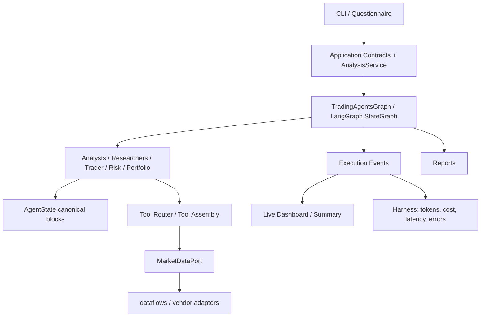

# TradingAgents 架构与 Agent 工程实践

> 面向 AI Agent / LLM 工程岗位的架构说明。
>
> 本文描述当前代码结构、历史重构成果和离线验证边界。**本轮没有运行真实 LLM API，也不把未运行的端到端链路、消融实验或正确性评测写成已验证结果。**

## 1. 先看结论

TradingAgents 不是把几个 Prompt 串起来，而是一个以 **LangGraph 状态图为流程骨架**、以 **多智能体节点为局部决策单元**、以 **Tool / Port / Dataflows 为能力边界**、以 **Application Contract 和 Execution Events 为稳定接口**的 Agent 系统。

它有两条主要业务链：

- **Screener**：从股票池开始，经过数据预筛、策略评分、信号合并和 Deep Analyzer，生成候选股票报告；
- **Analyzer**：针对单只股票，通过分析师、研究员、交易员和风控团队逐阶段协作，生成最终交易决策。

工程上最重要的工作并不是增加更多角色，而是把历史上的多入口、多驱动、多状态形状和供应商耦合，逐步收口为可观察、可测试、可扩展的边界。

### 证据标签

| 标签 | 含义 |
|---|---|
| ✅ **已验证** | 有当前源码、离线测试或仓库内报告产物支撑 |
| 🧱 **已实现 / 离线验证** | 代码路径和离线护栏存在，但本轮没有真实 API 运行 |
| 🧭 **待验证** | 治理报告提出的后续工作，本轮没有执行 |
| ⚠️ **限制** | 结果的适用边界，不能省略 |

---

## 2. 整体分层

### 2.1 Mermaid 架构图



### 2.2 纯文本版本

```text
CLI / Questionnaire
        │
        ▼
Application Contracts + AnalysisService
        │
        ▼
TradingAgentsGraph / LangGraph StateGraph
        │
        ├── Analysts → Researchers → Trader → Risk → Portfolio Manager
        │                         │
        │                         ▼
        │                    AgentState
        │
        ├── Agent Tools → Tool Router / Tool Assembly
        │                         │
        │                         ▼
        │              MarketDataPort → dataflows → vendor adapters
        │
        ├── stream_analysis() → Application Events → Live Dashboard / Summary
        │                                         └→ metrics / cost / audit trail
        │
        └── final state → reports/
```

### 2.3 每层解决什么问题

| 层 | 代表位置 | 责任 | 不应该做什么 |
|---|---|---|---|
| CLI / UI | `cli/`、`tradingagents/ui/` | 收集请求、显示事件、展示报告 | 不直接操作 LangGraph 内部对象 |
| Application | `tradingagents/application/` | 定义 `AnalysisRequest`、`AnalysisResult` 和事件流 | 不承载具体 Agent Prompt |
| Graph | `tradingagents/graph/` | 装配 StateGraph、连接阶段和条件路由 | 不把供应商细节散落在节点中 |
| Agents | `tradingagents/agents/` | 执行局部分析、辩论、计划和裁决 | 不直接负责 CLI 展示 |
| Tools / Ports | `agents/utils/`、`ports/` | 提供稳定能力接口和依赖注入边界 | 不把上层应用反向塞进通用层 |
| Dataflows | `tradingagents/dataflows/` | 路由数据工具、处理供应商结果和降级 | 不让每个 Agent 自己选择供应商 |
| LLM Clients | `tradingagents/llm_clients/` | 按 provider / model 创建客户端，统一参数入口 | 不在业务节点里复制 provider 分支 |
| Harness | `tradingagents/harness/` | Skill 注入、Token / 成本 / 使用信息和审计辅助 | 不替代业务决策逻辑 |

---

## 3. Analyzer：LangGraph 如何组织多智能体

### 3.1 请求从哪里进入

`AnalysisRequest` 是一次深度分析的类型化输入，字段包括：

- `ticker` 与 `trade_date`；
- 选中的分析师；
- 研究深度；
- LLM provider；
- quick / deep thinking model；
- provider-specific thinking 配置；
- 输出语言和可选 backend 配置。

`AnalysisRequest.to_graph_config()` 把这些字段转换为图运行时配置，避免 CLI 问卷字典直接穿透整个系统。对应实现见 [`tradingagents/application/contracts.py`](../tradingagents/application/contracts.py)。

`AnalysisService` 位于 CLI 和图运行时之间：

1. 构造 `TradingAgentsGraph`；
2. 调用公开的 `stream_analysis()`；
3. 用 `ChunkEventTranslator` 把原始状态 chunk 转成稳定事件；
4. 在流结束后组装 `AnalysisResult`。

因此，Live Dashboard 和无头 Python API 都可以消费同一条 Application 事件链。对应实现见 [`tradingagents/application/service.py`](../tradingagents/application/service.py)。

### 3.2 图的阶段

`GraphSetup.setup_graph()` 负责装配并编译 `StateGraph(AgentState)`：

```text
输入 ticker / trade_date / selected analysts
        │
        ▼
Analyst Team
  ├── Market Analyst
  ├── Social Analyst
  ├── News Analyst
  └── Fundamentals Analyst
        │
        ▼
Research Team
  ├── Bull Researcher
  ├── Bear Researcher
  └── Research Manager
        │
        ▼
Trader
        │
        ▼
Risk Team
  ├── Aggressive Analyst
  ├── Conservative Analyst
  ├── Neutral Analyst
  └── Portfolio Manager
        │
        ▼
Final decision
```

图装配代码见 [`tradingagents/graph/setup.py`](../tradingagents/graph/setup.py)。这里的关键工程点是：节点负责局部职责，路由和阶段交接由图来约束，最终裁决不会因为某个 CLI 入口的复制逻辑而产生另一套流程。

### 3.3 quick / deep 双模型

项目把模型调用按任务复杂度分层：

- **quick thinking model**：分析师、研究员和部分交接任务；
- **deep thinking model**：Research Manager、Portfolio Manager 等复杂裁决任务。

这不是“deep 模型一定更准确”的承诺，而是成本和任务复杂度的工程分配。LLM 客户端由 [`tradingagents/llm_clients/factory.py`](../tradingagents/llm_clients/factory.py) 按 provider 创建，provider-specific 分支集中在工厂和客户端模块，而不是散落到 Agent 节点。

---

## 4. AgentState：让状态成为契约

### 4.1 canonical 状态块

`AgentState` 贯穿整个图执行流程。当前迁移政策将结构化块定义为 canonical：

```text
ticker_info
  └── symbol / trade_date / selected_analysts / instrument context

analyst_reports
  └── market / sentiment / news / fundamentals

debate_blocks
  └── investment / risk

decision_blocks
  └── investment_plan / trader_plan / final_trade_decision

orchestration
  └── stage / phase / next_stage / compression / event trail

screener_context / semantic_prompt_slots
  └── 由筛选器传给下游决策节点的上下文
```

定义见 [`tradingagents/agents/utils/agent_states.py`](../tradingagents/agents/utils/agent_states.py)。

### 4.2 迁移期为什么还保留平铺字段

历史消费者仍然会读取 `market_report`、`investment_debate_state`、`final_trade_decision` 等平铺字段。因此当前策略不是一次性删除，而是：

- 新代码写结构化块；
- legacy 平铺字段作为兼容镜像；
- 结构化与平铺同时存在时，结构化状态优先；
- `schema_version` 标记状态契约版本；
- UI、日志和 fallback 在迁移期保留兼容路径。

这是一种“先建立权威，再逐步退役旧形状”的迁移方式。它比直接删掉旧字段更适合已经有历史报告、记忆和 UI 消费方的系统。

### 4.3 为什么这对 Agent 工程重要

如果 Agent 之间只传递随意拼接的字符串，新增一个字段往往需要同时修改节点、路由、日志、UI 和多个 CLI 驱动器。canonical state 把“谁写、谁读、谁负责兼容”变成可以测试的契约，也让后续新增 Agent 不必重新设计整个状态形状。

---

## 5. Tool Router → Ports → Dataflows

### 5.1 Agent 不直接绑定供应商

分析师通过工具获得行情、指标、基本面、新闻和事件信息；工具层通过路由表选择能力实现，数据层再根据配置和可用性处理具体来源。

概念链路是：

```text
Agent node
    ↓
Tool assembly / tool function
    ↓
route_to_vendor + method registry
    ↓
MarketDataPort（需要市场能力时）
    ↓
dataflows / vendor adapter
    ↓
Tencent / Sina / THS / AkShare / yfinance 等来源
```

`dataflows/interface.py` 中的工具分类和 `VENDOR_METHODS` 负责能力与实现映射；[`MarketDataPort`](../tradingagents/ports/market_data.py) 则为通用数据能力提供 Protocol 边界。

### 5.2 Port 解决了什么具体问题

`dataflows` 是通用数据层，不应该在模块级直接 import 上层 `screener`。Port 的默认工厂可以在运行时组合 `ScreenerDataAccess`，但模块级依赖图不会把通用层焊死到应用层。

同时，市场数据 Port 使用进程级共享实例，使限流器和历史缓存可以跨调用复用。测试可以注入 stub Port，不必访问真实网络。

### 5.3 错误与降级边界

供应商系统需要降级，但所有错误不应该都被吞成同一种 `None`。项目已经建立 `VendorError` 层级，包括 `VendorUnavailable`、`VendorRateLimited`、`DataNotFound` 和 `VendorSchemaChanged`，路由层可以据此识别预期失败。

当前仍有供应商底层捕获范围较宽的遗留代码，因此准确的表述是：

> 类型化错误地基已经建立，部分路由已经使用；vendors 的逐链路类型化仍是后续治理工作。

这比声称“所有供应商错误都已解决”更准确。

---

## 6. Execution Events 与 Harness 可观测性

### 6.1 原始 chunk 不直接暴露给 UI

[`ChunkEventTranslator`](../tradingagents/application/events.py) 是全仓唯一理解 LangGraph chunk 细节的稳定转换点。它把原始状态变化转换为事件协议，例如：

- `AnalysisStarted` / `AnalysisCompleted`
- `MessageEmitted`
- `ToolCallObserved`
- `ReportSectionUpdated`
- `AgentStatusChanged`
- `TimelineNoted`
- `StageMarked`
- `MetricsUpdated`

转换器还负责消息去重、分析师状态推导、辩论阶段状态和指标事件。Dashboard 只消费事件，不需要知道 chunk 的内部形状。

### 6.2 观测什么

Harness 和 Application 层可以将以下信息集中展示或记录：

```text
LLM 调用次数
工具调用次数
输入 / 输出 Token
成本估算
Agent 状态
阶段时间线
报告分段
错误与降级
Skill 注入和使用审计
```

`CostTracker` 负责累计 Token 使用量，Skill Injector 负责按决策类型和辩论轮次注入 Skill。它们是可观测性和上下文治理能力，不等于已经有真实 API 运行样本。

### 6.3 这套接口的收益

- CLI 可以换成 Web API 或其他 UI，而不用重新解释图 chunk；
- 测试可以直接验证稳定事件，而不是依赖 Rich 终端输出；
- 成本、延迟和错误可以和最终决策关联；
- 业务层可以在没有 UI 的情况下执行 `AnalysisService.run()`。

---

## 7. Screener 与 Analyzer 的边界

### Screener：候选发现

```text
Universe
  ↓
Data Access / vendor fallback
  ↓
Stage A 快速过滤
  ↓
Technical / Policy / Smart Money strategies
  ↓
Signal merger / conflict resolution
  ↓
DeepAnalyzer
  ↓
候选股票报告
```

Screener 关注候选股票发现、数据可用性、策略信号和排名；它不是最终的多智能体决策器。

### Analyzer：单标的深度分析

Analyzer 接收单只股票、日期、选中的分析师和研究配置，使用 LangGraph 完成分析、辩论、交易计划和风险裁决。Screener 结果可以通过 `screener_context` 和 `semantic_prompt_slots` 进入下游状态，但筛选信号不会自动变成 LLM 决策正确率。

这两个阶段通过 Application Contract 和结构化状态连接，而不是互相 import 对方的内部实现。

---

## 8. “铲屎山”重构：从长文件到可验证边界

这段工作的技术价值不在于删除了多少行，而在于先找到承重墙，再按依赖关系逐步收口。

### 8.1 诊断：表面症状背后的根因

历史诊断发现的问题包括：

- 多个入口和多个图执行驱动器；
- LangGraph 状态同时存在平铺和结构化形状；
- ImportError 可能静默切换到旧引擎；
- 通用数据层反向依赖 Screener；
- 配置存在双中心和可变全局状态；
- 供应商失败和编程错误缺少清晰边界；
- `ScreenerDataAccess` 曾经把供应商、解析、探测、限流和编排揉在一个 1905 行类中。

诊断报告是重构前的历史基线，不应把其中早期的测试数量或异常数量当作当前状态。

### 8.2 收口顺序

```text
先让入口可预测
  → 再让图执行只有一条主路径
  → 再确定 canonical state
  → 再用 Port 处理数据层依赖
  → 最后按变化原因拆分大门面
```

这个顺序的理由是：如果入口会静默换引擎，就无法判断后续重构到底运行了哪份代码；如果图驱动器有三份，新增状态字段和事件就必须同步三处；只有先收口执行边界，状态和数据层的测试才有可信上下文。

### 8.3 四个可复述的案例

#### 案例一：静默 ImportError fallback

重构前，新层导入失败可能悄悄回退到旧引擎。结果是开发者以为在测试新代码，实际上运行了旧路径。

治理方式是删除静默 fallback，让导入错误直接暴露；同时把安装入口指向统一 CLI，并为版本和命令注册增加离线护栏。

#### 案例二：三套图驱动器

官方 `propagate()`、新 CLI 的裸流循环和旧 Analyzer 各自执行图，错误恢复、状态补齐和日志行为可能不同。

治理方式是提取公开 `stream_analysis()`，让 `propagate()` 和 CLI 共享同一条图流内核；UI 只消费事件，不再访问 `graph.graph`、`graph.propagator` 或私有同步方法。

#### 案例三：AgentState 双写

同一份报告既存在平铺字段，又存在结构化块，任何新字段都可能漏同步。

治理方式是声明结构化块为 canonical，平铺字段降级为兼容镜像，引入 `schema_version`，并使用 canonical 契约测试锁定“结构化胜出”和“只补缺失”的行为。

#### 案例四：数据层反向依赖与 God Class

通用数据层曾经直接依赖 Screener，`ScreenerDataAccess` 还混合了供应商访问、解析、探测、限流和缓存。

治理方式是引入 `MarketDataPort`、打断依赖环，再将门面拆成 capability、vendor、parser、ticker format 和 HTTP politeness 等边界。施工记录中公开方法、签名、返回值和 fallback 顺序保持不变，避免“重构”变成行为重写。

### 8.4 验证策略

重构采用逐阶段离线护栏，而不是一次性大迁移。施工记录记录了从入口和图流测试，到 canonical state、依赖图、Port、解析器、Application Contract 和事件协议的逐步增加；交接报告随后记录总测试护栏达到 439 个。

这里的证据证明的是：

- 结构边界可以被测试；
- 公开行为和报告形状可以用 parity / golden 保护；
- 图流和事件协议可以在无网络、无 LLM 环境中验证。

它不证明真实 provider、真实 API 配额或端到端投资结果已经被本轮验证。

---

## 9. 当前证据与限制

### 已有证据

交接材料记录的回测产物包含：

- 总收益 `82.86%`；
- 夏普比率 `2.17`；
- 超额收益 `+56.57%`；
- 12 个月窗口；
- CSI300 当前成分池子集；
- 月度再平衡 top5；
- Technical 因子。

### 必须同时说明的限制

这些数字不是 LLM 决策准确率，也不是普遍盈利能力证明。它们受以下条件限制：

- 单一市场窗口；
- 未计交易成本；
- 只覆盖 Technical 因子；
- 当前成分池存在存续偏差；
- 尚未完成多窗口和 point-in-time 的完整审计。

### 本轮明确未执行

- 真实 API Key 端到端运行；
- 消融实验实跑；
- 正确性评测实跑；
- 多窗口回测；
- 交易成本敏感性改造；
- vendors 全量异常类型化。

后续治理方向见 [`docx/开发文件/治理报告-6-残余不足与治理方案.md`](../docx/开发文件/治理报告-6-残余不足与治理方案.md)，但这些方向不应在本轮被写成已完成结果。

---

## 10. 面试时的 5 分钟讲解顺序

1. **先讲问题**：系统原本不是“代码少”，而是入口、状态和数据边界不可预测；
2. **再讲架构**：Application Contract → LangGraph → AgentState → Tools / Ports → Dataflows；
3. **只讲一条数据流**：一个分析请求如何变成事件流和最终报告；
4. **讲一个重构案例**：三套图驱动统一为 `stream_analysis()`，并说明 UI 为什么因此解耦；
5. **讲证据和限制**：离线测试和回测能证明什么，真实 API 和业务有效性还缺什么。

最有说服力的结论不是“系统已经完美”，而是：

> 我知道哪些是代码能力，哪些是离线验证，哪些是业务证据，哪些仍然需要真实运行；我可以在不破坏行为的前提下继续演进它。
